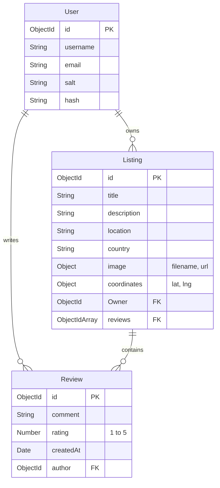

# TravelerMitra 🌍

[](https://nodejs.org/)
[](https://expressjs.com/)
[](https://www.mongodb.com/)
[](https://cloudinary.com/)
[](https://leafletjs.com/)

**TravelerMitra** is a feature-rich, full-stack travel platform designed to browse, list, and review unique destinations worldwide. Built with modern backend engineering principles, the project follows a decoupled **MVC (Model-View-Controller)** pattern, secure session-based authentication, server-side validation, and cloud-based asset/map integrations.

---

## 🌟 Core Features & Architecture

### 1. Decoupled MVC Architecture
- Follows the industry-standard separation of concerns.
- decodes routes, controllers, database models, utilities, and view presentation layers cleanly.

### 2. Cloud Image Upload (Multer & Cloudinary)
- Handles file uploads using `multer` and `multer-storage-cloudinary`.
- Automatically hosts listing images in the cloud instead of local file storage to ensure server statelessness and scalability.

### 3. Interactive Mapping (Leaflet & OpenStreetMap)
- Features geocoding of destinations on creation using the open-source **Nominatim API**.
- Coordinates are stored as GeoJSON properties in MongoDB.
- Dynamic maps render using the **Leaflet.js** client library with visual **Markers** and **Popup Banners** showing title and location.

### 4. Advanced Search & Category Filters
- Case-insensitive searching by title, location, or country using MongoDB `$regex` expressions.
- Horizontal-scrolling category bar (Trending, Rooms, Castles, Pools, Camping, Farms) with subtle slide hover transitions.

### 5. Dynamic Tax Calculator Toggle
- Dynamic Bootstrap form-switch allowing users to instantly switch listings between base-price rates and total tax-inclusive rates (+18% GST) without page reloads.

### 6. Authentication & Session Store
- Secure user signup, login, and authorization guards powered by `passport` and `passport-local-mongoose`.
- Session persistence handles logins across restarts using `connect-mongo` session storage.

### 7. Schema Validation (Joi)
- Prevent dirty data entries using `Joi` schema validation middlewares before Mongoose saves documents.

---

## 🛠️ Technology Stack

| Component | Technology | Description |
|-----------|------------|-------------|
| **Backend** | Node.js, Express.js | Core environment and routing engine |
| **Database** | MongoDB, Mongoose | Document database with ODM layers |
| **Session** | Connect-Mongo, Express-Session | Session store and cookie tracking |
| **Auth** | Passport.js, Passport-Local | Security and user encryption |
| **Validation** | Joi | Input schema validation |
| **Cloud Storage** | Cloudinary | Digital media hosting |
| **Geocoding** | Nominatim (OpenStreetMap) | Location text-to-coordinate parser |
| **Maps** | Leaflet.js | Interactive vector mapping |
| **Frontend** | EJS, EJS-Mate, CSS3, Bootstrap 5 | Presentation and layout engine |

---

## 📂 Decoupled Directory Structure

```text
travelermitra/
├── 📂 controllers/      # Route execution logic (MVC Controllers)
├── 📂 init/             # Data seeding & migration scripts
├── 📂 models/           # Mongoose Database Schemas & relationships
├── 📂 public/           # Static assets (CSS styles, client script files)
├── 📂 routes/           # Decoupled Express routers
├── 📂 utils/            # Async helpers & custom error classes
├── 📂 views/            # Presentation templates (EJS pages)
│   ├── 📂 includes/     # Partials (navbar, footer, flash alerts)
│   ├── 📂 layouts/      # Base boilerplate layout
│   ├── 📂 listing/      # Listing action views
│   └── 📂 users/        # Authentication views
├── 📄 app.js            # Core App configuration & middleware chain
├── 📄 middleware.js     # Route guards (Authentication, Ownership checks)
└── 📄 schema.js         # Joi schema validations
```

---

## 💾 Database Schema & Relationships



---

## 💻 Local Installation & Run Guide

### 1. Clone & Install Dependencies
```bash
git clone <your-repository-link>
cd travelermitra
npm install
```

### 2. Configure Environment variables
Create a `.env` file in the root directory:
```env
CLOUD_NAME=your_cloudinary_name
CLOUD_API_KEY=your_cloudinary_api_key
CLOUD_API_SECRET=your_cloudinary_api_secret
ATLASDB_URL=your_atlas_connection_string
```

### 3. Run Seeding & Database Migrations (Optional)
```bash
# Seed the database with local sample dataset
node init/index.js

# Generate location coordinates for all existing listings
node init/update_coordinates.js
```

### 4. Start Server
```bash
# Starts development server (with nodemon if installed)
nodemon app.js
```
Open browser: `http://localhost:8080/` 🚀

---

## 🛡️ Production & Security Best Practices Implemented

- **Safe Script Evaluation**: Dynamic map rendering values (e.g. coordinates, titles) are passed to client JS safely via HTML `data-*` dataset attributes, preventing script injection bugs.
- **Route Authorization Guards**: User authentication (`isLoggedIn`) and ownership checks (`isOwner`, `isReviewAuthor`) block unauthorized queries before expensive Cloudinary file uploads or database modifications take place.
- **Defensive Error Handling**: WrapAsync wrappers capture database exceptions, rendering a clean custom error page instead of disclosing system call stacks to the end user.
